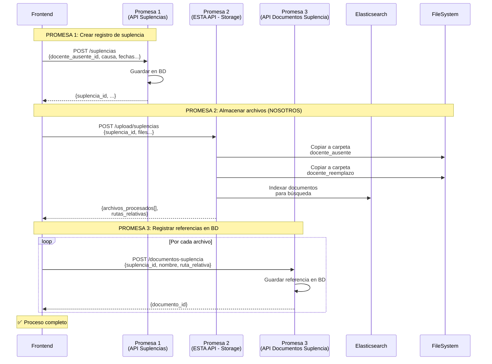

# 📤 PROMESA 2: API de Storage para Suplencias - Documentación para Integración

## 🎯 Descripción General

**IMPORTANTE:** Esta es la documentación de la **API de Storage (Promesa 2)** para que los equipos de **Frontend** y **Backend de Suplencias (Promesa 3)** puedan integrarse con nuestro servicio.

### 🔧 Somos la Promesa 2 - API de Document Handler

Nuestra API es responsable de:

1. ✅ Recibir archivos del frontend (certificados médicos, permisos, etc.)
2. ✅ Guardar archivos con Multer en carpetas organizadas por empleado
3. ✅ Copiar archivos a las carpetas de AMBOS docentes (ausente y reemplazo)
4. ✅ Indexar documentos en Elasticsearch para búsqueda
5. ✅ Devolver información estructurada para que la Promesa 3 registre en BD

### 📍 Ubicación de esta API

- **Repositorio:** `SIGED/DOCUMENT_HANDLER_API`
- **Puerto:** `6133`
- **URL Producción:** `https://demo-facilwhatsappapi.facilcreditos.co`
- **Tecnologías:** Express.js + TypeScript + Multer + Elasticsearch

---

---

## � Resumen Ejecutivo

### Para el equipo de Frontend:

1. **Llamas a nuestra API** después de crear la suplencia (Promesa 1)
2. **Nos envías:** `suplencia_id`, `docente_ausente_id`, `docente_reemplazo_id` y los archivos
3. **Te devolvemos:** Array con información de cada archivo procesado (nombre, ruta, tamaño, etc.)
4. **Usas nuestra respuesta** para llamar a la Promesa 3 (registro en BD)

### Para el equipo de Backend Suplencias (Promesa 3):

- **Nosotros YA guardamos** los archivos en el filesystem
- **Nosotros YA indexamos** los archivos en Elasticsearch
- **Ustedes solo registran** la referencia en su base de datos usando la `ruta_relativa` que les devolvemos

---

## �🔄 Flujo Completo de las 3 Promesas



---

## 📡 Endpoint de Nuestra API

### **POST** `/api/documents/upload/suplencias`

**🌐 URLs de Nuestra API:**

- **Producción:** `https://demo-facilwhatsappapi.facilcreditos.co/api/documents/upload/suplencias`
- **Desarrollo:** `http://localhost:6133/api/documents/upload/suplencias`

**⚠️ Importante para el equipo Frontend:**
Deben llamar a ESTA URL para subir archivos. Nosotros nos encargamos del almacenamiento y la indexación.

---

## 📥 Request (Cómo llamar desde el Frontend)

### Headers Requeridos

```http
Content-Type: multipart/form-data
Authorization: Bearer <token_jwt>
```

### Body (FormData)

```typescript
interface RequestBody {
  suplencia_id: string;              // ✅ REQUERIDO: UUID de la suplencia (viene de Promesa 1)
  docente_ausente_id: string;        // ✅ REQUERIDO: UUID del docente ausente
  docente_reemplazo_id: string;      // ✅ REQUERIDO: UUID del docente reemplazo
  tipo_documento?: string;           // ⚪ OPCIONAL: Tipo de documento (default: 'suplencias')
  files: File[];                     // ✅ REQUERIDO: Archivos a subir
}
```

### Ejemplo con JavaScript Vanilla (fetch)

```javascript
// Datos de la Promesa 1 (suplencia creada)
const suplenciaData = {
  suplencia_id: "550e8400-e29b-41d4-a716-446655440000",
  docente_ausente_id: "3389ecbe-a18c-11f0-99f3-0242ac120002",
  docente_reemplazo_id: "3389ecbe-a18c-11f0-99f3-0242ac120003"
};

// Archivos seleccionados por el usuario
const archivos = document.getElementById('file-input').files;

// Crear FormData
const formData = new FormData();
formData.append('suplencia_id', suplenciaData.suplencia_id);
formData.append('docente_ausente_id', suplenciaData.docente_ausente_id);
formData.append('docente_reemplazo_id', suplenciaData.docente_reemplazo_id);
formData.append('tipo_documento', 'suplencia');

// Agregar archivos al FormData
for (let i = 0; i < archivos.length; i++) {
  formData.append('files', archivos[i]);
}

// 🚀 Hacer la petición (PROMESA 2)
const response = await fetch('https://api-siged.com/api/documents/upload/suplencias', {
  method: 'POST',
  headers: {
    'Authorization': `Bearer ${token}`
    // NO incluir 'Content-Type' - fetch lo agrega automáticamente con boundary
  },
  body: formData
});

const resultado = await response.json();
console.log('✅ Promesa 2 completada:', resultado);
```

### Ejemplo con Axios

```typescript
import axios from 'axios';

async function subirArchivosSuplencia(
  suplenciaId: string,
  docenteAusenteId: string,
  docenteReemplazoId: string,
  archivos: File[]
): Promise<any> {
  
  const formData = new FormData();
  formData.append('suplencia_id', suplenciaId);
  formData.append('docente_ausente_id', docenteAusenteId);
  formData.append('docente_reemplazo_id', docenteReemplazoId);
  formData.append('tipo_documento', 'suplencia');
  
  // Agregar archivos
  archivos.forEach((archivo) => {
    formData.append('files', archivo);
  });
  
  const token = localStorage.getItem('siged_access_token');
  
  const response = await axios.post(
    'https://api-siged.com/api/documents/upload/suplencias',
    formData,
    {
      headers: {
        'Authorization': `Bearer ${token}`,
        'Content-Type': 'multipart/form-data'
      }
    }
  );
  
  return response.data;
}
```

### Ejemplo con React Hook

```typescript
import { useState } from 'react';
import axios from 'axios';

interface ArchivoSuplencia {
  nombre_original: string;
  nombre_guardado: string;
  ruta_relativa: string;
  size: number;
  mimetype: string;
  docente_ausente: {
    empleado_id: string;
    ruta_relativa: string;
  };
  docente_reemplazo: {
    empleado_id: string;
    ruta_relativa: string;
  };
  elasticsearch_id?: string;
}

interface ResponsePromesa2 {
  success: boolean;
  message: string;
  data: {
    suplencia_id: string;
    total_archivos: number;
    archivos_procesados: ArchivoSuplencia[];
    elasticsearch_indexados: number;
    timestamp: string;
  };
}

export function useUploadSuplenciaFiles() {
  const [isLoading, setIsLoading] = useState(false);
  const [error, setError] = useState<string | null>(null);
  const [progress, setProgress] = useState(0);
  
  const uploadFiles = async (
    suplenciaId: string,
    docenteAusenteId: string,
    docenteReemplazoId: string,
    files: File[]
  ): Promise<ResponsePromesa2> => {
    
    setIsLoading(true);
    setError(null);
    setProgress(0);
    
    try {
      const formData = new FormData();
      formData.append('suplencia_id', suplenciaId);
      formData.append('docente_ausente_id', docenteAusenteId);
      formData.append('docente_reemplazo_id', docenteReemplazoId);
      
      files.forEach((file) => {
        formData.append('files', file);
      });
      
      const token = localStorage.getItem('siged_access_token');
      
      const response = await axios.post<ResponsePromesa2>(
        'https://api-siged.com/api/documents/upload/suplencias',
        formData,
        {
          headers: {
            'Authorization': `Bearer ${token}`,
            'Content-Type': 'multipart/form-data'
          },
          onUploadProgress: (progressEvent) => {
            const percentCompleted = Math.round(
              (progressEvent.loaded * 100) / (progressEvent.total || 100)
            );
            setProgress(percentCompleted);
          }
        }
      );
      
      setProgress(100);
      return response.data;
      
    } catch (err: any) {
      const errorMessage = err.response?.data?.message || err.message || 'Error al subir archivos';
      setError(errorMessage);
      throw new Error(errorMessage);
    } finally {
      setIsLoading(false);
    }
  };
  
  return { uploadFiles, isLoading, error, progress };
}
```

---

## 📤 Response (Qué devuelve la API)

### Response Success (200 OK)

```typescript
interface ResponsePromesa2 {
  success: boolean;
  message: string;
  data: {
    suplencia_id: string;              // UUID de la suplencia
    total_archivos: number;            // Cantidad de archivos procesados
    archivos_procesados: Array<{
      nombre_original: string;         // Nombre original del archivo
      nombre_guardado: string;         // Nombre con el que se guardó
      ruta_relativa: string;           // Ruta relativa principal (para BD)
      size: number;                    // Tamaño en bytes
      mimetype: string;                // Tipo MIME (application/pdf, image/jpeg, etc.)
      docente_ausente: {
        empleado_id: string;           // UUID del docente ausente
        ruta_completa: string;         // Ruta completa en el servidor
        ruta_relativa: string;         // Ruta relativa para este docente
      };
      docente_reemplazo: {
        empleado_id: string;           // UUID del docente reemplazo
        ruta_completa: string;         // Ruta completa en el servidor
        ruta_relativa: string;         // Ruta relativa para este docente
      };
      elasticsearch_id?: string;       // ID en Elasticsearch (si se indexó)
    }>;
    elasticsearch_indexados: number;   // Cantidad indexados en Elasticsearch
    timestamp: string;                 // ISO timestamp del procesamiento
  };
}
```

### Ejemplo de Response Real

```json
{
  "success": true,
  "message": "3 archivos procesados exitosamente",
  "data": {
    "suplencia_id": "550e8400-e29b-41d4-a716-446655440000",
    "total_archivos": 3,
    "archivos_procesados": [
      {
        "nombre_original": "certificado_medico.pdf",
        "nombre_guardado": "2025_suplencia_550e8400_1736160000000_certificado_medico.pdf",
        "ruta_relativa": "uploads/2025/3389ecbe-a18c-11f0-99f3-0242ac120002/suplencias/2025_suplencia_550e8400_1736160000000_certificado_medico.pdf",
        "size": 245678,
        "mimetype": "application/pdf",
        "docente_ausente": {
          "empleado_id": "3389ecbe-a18c-11f0-99f3-0242ac120002",
          "ruta_completa": "/app/uploads/2025/3389ecbe-a18c-11f0-99f3-0242ac120002/suplencias/2025_suplencia_550e8400_1736160000000_certificado_medico.pdf",
          "ruta_relativa": "uploads/2025/3389ecbe-a18c-11f0-99f3-0242ac120002/suplencias/2025_suplencia_550e8400_1736160000000_certificado_medico.pdf"
        },
        "docente_reemplazo": {
          "empleado_id": "3389ecbe-a18c-11f0-99f3-0242ac120003",
          "ruta_completa": "/app/uploads/2025/3389ecbe-a18c-11f0-99f3-0242ac120003/suplencias/2025_suplencia_550e8400_1736160000000_certificado_medico.pdf",
          "ruta_relativa": "uploads/2025/3389ecbe-a18c-11f0-99f3-0242ac120003/suplencias/2025_suplencia_550e8400_1736160000000_certificado_medico.pdf"
        },
        "elasticsearch_id": "doc-123-abc-456"
      },
      {
        "nombre_original": "permiso_laboral.pdf",
        "nombre_guardado": "2025_suplencia_550e8400_1736160001000_permiso_laboral.pdf",
        "ruta_relativa": "uploads/2025/3389ecbe-a18c-11f0-99f3-0242ac120002/suplencias/2025_suplencia_550e8400_1736160001000_permiso_laboral.pdf",
        "size": 189023,
        "mimetype": "application/pdf",
        "docente_ausente": {
          "empleado_id": "3389ecbe-a18c-11f0-99f3-0242ac120002",
          "ruta_completa": "/app/uploads/2025/3389ecbe-a18c-11f0-99f3-0242ac120002/suplencias/2025_suplencia_550e8400_1736160001000_permiso_laboral.pdf",
          "ruta_relativa": "uploads/2025/3389ecbe-a18c-11f0-99f3-0242ac120002/suplencias/2025_suplencia_550e8400_1736160001000_permiso_laboral.pdf"
        },
        "docente_reemplazo": {
          "empleado_id": "3389ecbe-a18c-11f0-99f3-0242ac120003",
          "ruta_completa": "/app/uploads/2025/3389ecbe-a18c-11f0-99f3-0242ac120003/suplencias/2025_suplencia_550e8400_1736160001000_permiso_laboral.pdf",
          "ruta_relativa": "uploads/2025/3389ecbe-a18c-11f0-99f3-0242ac120003/suplencias/2025_suplencia_550e8400_1736160001000_permiso_laboral.pdf"
        },
        "elasticsearch_id": "doc-789-def-012"
      },
      {
        "nombre_original": "autorizacion.pdf",
        "nombre_guardado": "2025_suplencia_550e8400_1736160002000_autorizacion.pdf",
        "ruta_relativa": "uploads/2025/3389ecbe-a18c-11f0-99f3-0242ac120002/suplencias/2025_suplencia_550e8400_1736160002000_autorizacion.pdf",
        "size": 123456,
        "mimetype": "application/pdf",
        "docente_ausente": {
          "empleado_id": "3389ecbe-a18c-11f0-99f3-0242ac120002",
          "ruta_completa": "/app/uploads/2025/3389ecbe-a18c-11f0-99f3-0242ac120002/suplencias/2025_suplencia_550e8400_1736160002000_autorizacion.pdf",
          "ruta_relativa": "uploads/2025/3389ecbe-a18c-11f0-99f3-0242ac120002/suplencias/2025_suplencia_550e8400_1736160002000_autorizacion.pdf"
        },
        "docente_reemplazo": {
          "empleado_id": "3389ecbe-a18c-11f0-99f3-0242ac120003",
          "ruta_completa": "/app/uploads/2025/3389ecbe-a18c-11f0-99f3-0242ac120003/suplencias/2025_suplencia_550e8400_1736160002000_autorizacion.pdf",
          "ruta_relativa": "uploads/2025/3389ecbe-a18c-11f0-99f3-0242ac120003/suplencias/2025_suplencia_550e8400_1736160002000_autorizacion.pdf"
        },
        "elasticsearch_id": "doc-345-ghi-678"
      }
    ],
    "elasticsearch_indexados": 3,
    "timestamp": "2025-01-06T10:00:00.000Z"
  }
}
```

---

## ❌ Errores Posibles

### Error 400: No se enviaron archivos

```json
{
  "success": false,
  "message": "No se han proporcionado archivos",
  "error": "No files uploaded"
}
```

### Error 400: Falta suplencia_id

```json
{
  "success": false,
  "message": "suplencia_id es requerido",
  "error": "Missing suplencia_id"
}
```

### Error 400: Faltan IDs de docentes

```json
{
  "success": false,
  "message": "docente_ausente_id y docente_reemplazo_id son requeridos",
  "error": "Missing employee IDs"
}
```

### Error 500: Error interno del servidor

```json
{
  "success": false,
  "message": "Error al procesar archivos de suplencia",
  "error": "Internal server error"
}
```

---

## 🔗 Integración con Promesa 3

### Datos que necesitas pasar a la Promesa 3

De la respuesta de la Promesa 2, necesitas extraer:

```typescript
// De cada archivo en archivos_procesados:
{
  suplencia_id: string;          // ✅ Viene del data.suplencia_id
  nombre: string;                // ✅ Usar archivo.nombre_original
  ruta_relativa: string;         // ✅ Usar archivo.ruta_relativa
}
```

### Ejemplo de Flujo Completo (3 Promesas)

```typescript
async function crearSuplenciaCompleta(
  dataSuplencia: ICreateSuplencia,
  archivos: File[]
): Promise<void> {
  
  try {
    // ===== PROMESA 1: Crear Suplencia =====
    console.log('📝 Paso 1/3: Creando suplencia...');
    const promesa1 = await fetch('https://api-siged.com/api/v1/suplencias', {
      method: 'POST',
      headers: {
        'Content-Type': 'application/json',
        'Authorization': `Bearer ${token}`
      },
      body: JSON.stringify(dataSuplencia)
    });
    
    const { data: suplencia } = await promesa1.json();
    console.log('✅ Suplencia creada:', suplencia.id);
    
    // ===== PROMESA 2: Subir Archivos (ESTE ENDPOINT) =====
    console.log('📤 Paso 2/3: Subiendo archivos...');
    const formData = new FormData();
    formData.append('suplencia_id', suplencia.id);
    formData.append('docente_ausente_id', dataSuplencia.docente_ausente_id);
    formData.append('docente_reemplazo_id', dataSuplencia.docente_reemplazo_id);
    
    archivos.forEach(archivo => {
      formData.append('files', archivo);
    });
    
    const promesa2 = await fetch('https://api-siged.com/api/documents/upload/suplencias', {
      method: 'POST',
      headers: {
        'Authorization': `Bearer ${token}`
      },
      body: formData
    });
    
    const { data: resultadoArchivos } = await promesa2.json();
    console.log('✅ Archivos subidos:', resultadoArchivos.total_archivos);
    
    // ===== PROMESA 3: Registrar Documentos en BD =====
    console.log('📋 Paso 3/3: Registrando documentos en BD...');
    const promesasDocumentos = resultadoArchivos.archivos_procesados.map(archivo =>
      fetch('https://api-siged.com/api/v1/documentos-suplencia', {
        method: 'POST',
        headers: {
          'Content-Type': 'application/json',
          'Authorization': `Bearer ${token}`
        },
        body: JSON.stringify({
          suplencia_id: resultadoArchivos.suplencia_id,
          nombre: archivo.nombre_original,
          ruta_relativa: archivo.ruta_relativa
        })
      })
    );
    
    await Promise.all(promesasDocumentos);
    console.log('✅ Documentos registrados en BD');
    
    console.log('🎉 Proceso completo exitoso!');
    
  } catch (error) {
    console.error('❌ Error en el flujo:', error);
    throw error;
  }
}
```

---

## 📁 Estructura de Carpetas Creadas

Los archivos se guardan en la siguiente estructura:

```
uploads/
└── 2025/                                    # Año actual
    ├── 3389ecbe-a18c-11f0-99f3-0242ac120002/    # UUID docente ausente
    │   └── suplencias/                           # Tipo de documento
    │       ├── 2025_suplencia_550e8400_1736160000000_certificado_medico.pdf
    │       ├── 2025_suplencia_550e8400_1736160001000_permiso_laboral.pdf
    │       └── 2025_suplencia_550e8400_1736160002000_autorizacion.pdf
    │
    └── 3389ecbe-a18c-11f0-99f3-0242ac120003/    # UUID docente reemplazo
        └── suplencias/                           # Mismo tipo de documento
            ├── 2025_suplencia_550e8400_1736160000000_certificado_medico.pdf
            ├── 2025_suplencia_550e8400_1736160001000_permiso_laboral.pdf
            └── 2025_suplencia_550e8400_1736160002000_autorizacion.pdf
```

### Formato del Nombre de Archivo

```
{año}_suplencia_{suplencia_id_short}_{timestamp}_{nombre_original}.{extension}
```

**Ejemplo:**
```
2025_suplencia_550e8400_1736160000000_certificado_medico.pdf
```

---

## 🔍 Indexación en Elasticsearch

Cada archivo se indexa en Elasticsearch con la siguiente estructura:

```json
{
  "id": "doc-123-abc-456",
  "title": "certificado_medico.pdf",
  "content": "texto extraído del PDF...",
  "keywords": ["certificado", "medico", "incapacidad"],
  "tags": ["suplencia", "suplencias"],
  "category": "suplencias",
  "employeeUuid": "3389ecbe-a18c-11f0-99f3-0242ac120002",
  "documentType": "suplencias",
  "uploadDate": "2025-01-06T10:00:00.000Z",
  "year": 2025,
  "filename": "2025_suplencia_550e8400_1736160000000_certificado_medico.pdf",
  "mimetype": "application/pdf",
  "size": 245678,
  "relativePath": "uploads/2025/3389ecbe-a18c-11f0-99f3-0242ac120002/suplencias/...",
  "metadata": {
    "suplencia_id": "550e8400-e29b-41d4-a716-446655440000",
    "docente_ausente_id": "3389ecbe-a18c-11f0-99f3-0242ac120002",
    "docente_reemplazo_id": "3389ecbe-a18c-11f0-99f3-0242ac120003",
    "tipo": "suplencia"
  }
}
```

---

## 🧪 Testing con cURL

### Test básico con un archivo

```bash
curl -X POST https://api-siged.com/api/documents/upload/suplencias \
  -H "Authorization: Bearer YOUR_TOKEN" \
  -F "suplencia_id=550e8400-e29b-41d4-a716-446655440000" \
  -F "docente_ausente_id=3389ecbe-a18c-11f0-99f3-0242ac120002" \
  -F "docente_reemplazo_id=3389ecbe-a18c-11f0-99f3-0242ac120003" \
  -F "files=@/path/to/certificado_medico.pdf" \
  -F "files=@/path/to/permiso_laboral.pdf"
```

### Test con tipo de documento personalizado

```bash
curl -X POST https://api-siged.com/api/documents/upload/suplencias \
  -H "Authorization: Bearer YOUR_TOKEN" \
  -F "suplencia_id=550e8400-e29b-41d4-a716-446655440000" \
  -F "docente_ausente_id=3389ecbe-a18c-11f0-99f3-0242ac120002" \
  -F "docente_reemplazo_id=3389ecbe-a18c-11f0-99f3-0242ac120003" \
  -F "tipo_documento=certificados_medicos" \
  -F "files=@/path/to/documento.pdf"
```

---

## 📊 Límites y Restricciones

| Límite | Valor |
|--------|-------|
| Tamaño máximo por archivo | 1 GB |
| Cantidad máxima de archivos | Sin límite (recomendado: máx 10 por request) |
| Tipos de archivo permitidos | PDF, DOC, DOCX, TXT, JPG, PNG, XLS, XLSX |
| Timeout de request | 20 minutos |

---

## ✅ Checklist de Integración Frontend

- [ ] Crear FormData con `suplencia_id`, `docente_ausente_id`, `docente_reemplazo_id`
- [ ] Agregar archivos al FormData con `formData.append('files', archivo)`
- [ ] Incluir header `Authorization: Bearer <token>`
- [ ] NO incluir header `Content-Type` (se agrega automáticamente)
- [ ] Manejar respuesta exitosa (200) con `data.archivos_procesados`
- [ ] Manejar errores (400, 500) con mensajes apropiados
- [ ] Mostrar progreso de subida (opcional con `onUploadProgress`)
- [ ] Pasar `ruta_relativa` de cada archivo a la Promesa 3
- [ ] Usar `nombre_original` y `suplencia_id` para Promesa 3

---

## 🎯 Resumen para el Frontend

### Qué enviar (Input)

```typescript
{
  suplencia_id: string;           // De la Promesa 1
  docente_ausente_id: string;     // Del formulario
  docente_reemplazo_id: string;   // Del formulario
  files: File[];                  // Archivos seleccionados
}
```

### Qué recibir (Output)

```typescript
{
  success: true,
  data: {
    suplencia_id: string,
    archivos_procesados: [
      {
        nombre_original: string,      // ⭐ Usar para Promesa 3
        ruta_relativa: string,        // ⭐ Usar para Promesa 3
        size: number,
        mimetype: string,
        elasticsearch_id?: string
      }
    ]
  }
}
```

### Qué hacer con la respuesta

```typescript
// Extraer datos para Promesa 3
const datosPara Promesa3 = resultado.data.archivos_procesados.map(archivo => ({
  suplencia_id: resultado.data.suplencia_id,
  nombre: archivo.nombre_original,
  ruta_relativa: archivo.ruta_relativa
}));

// Enviar a Promesa 3
for (const doc of datosParaPromesa3) {
  await registrarDocumentoEnBD(doc);
}
```

---

## 🚀 ¡Listo para usar!

La Promesa 2 está completamente implementada y lista para recibir peticiones. El endpoint está disponible en:

```
POST https://api-siged.com/api/documents/upload/suplencias
```

o en desarrollo:

```
POST http://localhost:6133/api/documents/upload/suplencias
```

**¡Toda la lógica de almacenamiento, indexación y organización de archivos está automatizada! 🎉**
